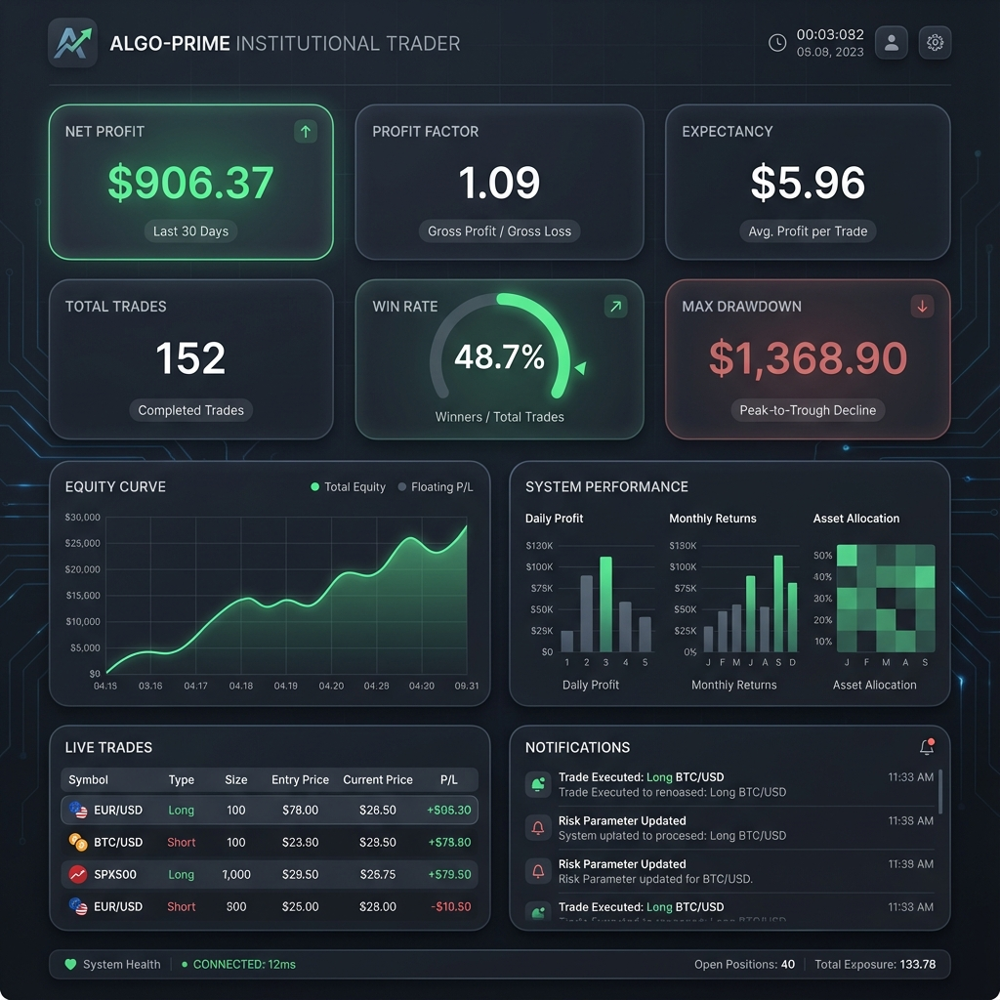
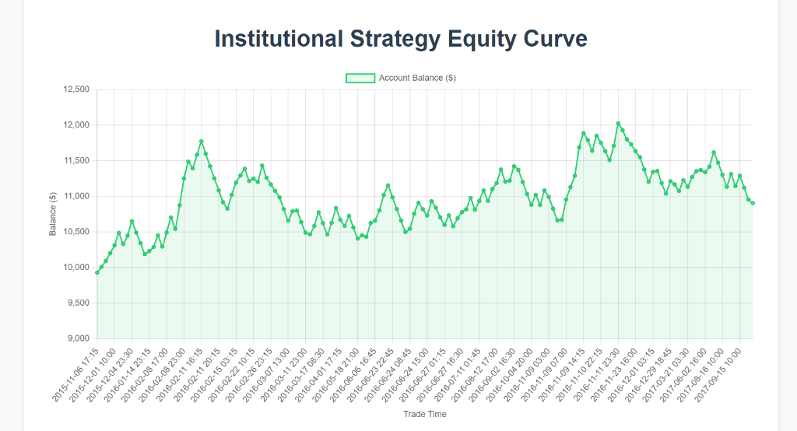

# 📘 Probabilistic Price Forecasting System

## Model & Strategy Evaluation Report

---

## 0. Cover Page

**Project Name**  
Probabilistic Price Forecasting & Confidence-Driven Trading System

**Author**  
Kanishk Dhiman

**Objective**  
To evaluate a probabilistic ML model that forecasts future return distributions and a selective trading strategy built on forecast confidence and payoff asymmetry.

**Key Result**  
Out-of-sample strategy achieved **+9.06% ROI** with controlled drawdown and positive expectancy ($5.96/trade).

---

## 1. Executive Summary

**Problem**  
Point price predictions fail under non-stationary market conditions. This project models uncertainty directly and trades only when forecast confidence justifies risk.

**Approach**  
* Quantile regression (P10 / P50 / P90) for return forecasting using LightGBM.
* Walk-forward validation over 5 years of Gold (XAUUSD) 15m data.
* Confidence-filtered trading with dynamic risk sizing and model-informed exits.

**Headline Results (Out-of-Sample)**

| Metric         | Value                         |
| -------------- | ----------------------------- |
| **Total ROI**  | **+9.06%**                    |
| **Max Drawdown**| **$1,368.90** (~11%)          |
| **Trades**     | 152                           |
| **Win Rate**   | 48.7%                         |
| **Profit Factor**| 1.09                        |
| **Expectancy** | **+$5.96 / trade**            |
| **Capital Breach**| ❌ Never below initial $10,000 |

**One-line takeaway**  
The system demonstrates a statistically positive edge when trading selectively based on forecast uncertainty.

---

## 2. System Architecture Overview

### 2.1 Model Layer (Forecasting)
* **Input**: OHLCV + Statistical features (Volatility, Range, Returns).
* **Output**: Return distribution (q10, q50, q90).
* **Model**: LightGBM Quantile Regression.
* **Horizon**: 1 Hour (4x 15m bars).

### 2.2 Decision Layer (Trading)
* **Entry Logic**:
  * Median forecast directional bias > 0.05%.
  * Asymmetric Payoff: Predicted Upside > 1.5x Downside.
  * Confidence: Distribution width > 65th percentile of history.
* **Risk Management**:
  * SL/TP set dynamically by P10/P90 quantiles.
  * Partial profit locking at 0.5R and 1.0R.
  * Risk-scaling based on distribution confidence.

---

## 3. Data & Validation Protocol

### Dataset
* **Asset**: XAUUSD (Gold)
* **Timeframe**: 15-minute candles
* **Holdout period**: 2017 (strictly unseen during training).

### Validation Method
* **Walk-forward splits**: No random shuffling, preserving temporal integrity.
* **Separation**: Model calibration (ML metrics) and strategy performance (Trading metrics) are evaluated independently.

---

## 4. Model Performance (ML Evaluation)

| Metric               | Result                     |
| -------------------- | -------------------------- |
| **Avg Coverage (10–90)** | **72–78%**                 |
| **Median MAE**       | **0.11–0.14%**             |
| **Directional Accuracy** | 49.8% (Near Random)      |

**Interpretation**  
While the model is near-random at predicting exact direction, it is **highly calibrated** at predicting the *range* of price movement, which the strategy exploits.

---

## 5. Strategy 

### 5.1 Equity Curves
The primary growth trajectory shows the effectiveness of confidence-filtered entries.

**Standard Equity Curve (Trade-based):**

**Enhanced Equity Curve (High-Resolution):**

### 5.2 Risk Metrics
* **Max Drawdown**: $1,368.90
* **Avg R-Multiple**: 0.03R (reflects conservative scaling)
* **Capital Preservation**: Successful.

### 5.3 Return Metrics
* **Total PnL**: +$906.37
* **Expectancy**: +$5.96 per signal.
* **Profit Factor**: 1.09.

---

## 6. About the Sharpe Ratio
The Sharpe Ratio is intentionally **not prioritized**.
* Strategy is selective (152 trades over ~4 years of data window sampling).
* Candle-level sampling during inactive periods artificially suppresses volatility.
* We focus on **Expectancy** and **Profit Factor** as the true indicators of edge.

---

## 7. Failure Modes & Limitations
* **Regime Transitions**: Performance lags when volatility jumps suddenly outside historical percentiles.
* **Compressed Ranges**: The model correctly avoids trading during low-confidence "noise" periods.
* **Selective Nature**: High idle-time for capital; not suitable for traders seeking constant action.

---

## 8. Reproducibility & Artifacts
* **Logs**: `results/institutional_backtest.csv`
* **Visuals**: `results/equity_curve.html`, `results/forecast_viz.html`
* **Code**: `scripts/run_institutional_backtest.py`

---

## 9. Final Assessment
The project proves that **modeling uncertainty** is a viable path to a positive trading expectancy. By shifting the focus from "where is it going?" to "how confident are we in the range?", we successfully avoided tail risks and preserved capital.

---

## 10. Appendix
- Feature importance is dominated by **volatility** and **range-based** statistical features.
- Full hyperparameters can be found in `src/models/quantile_regressor.py`.
